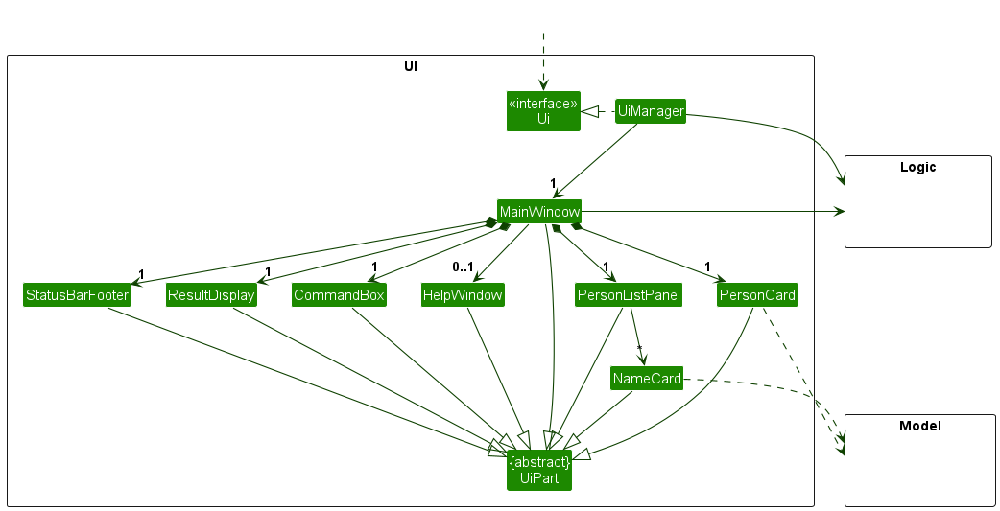
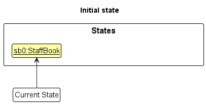
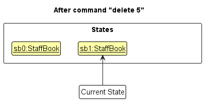
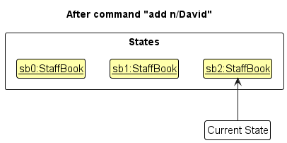
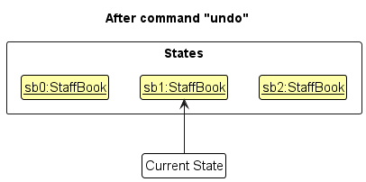
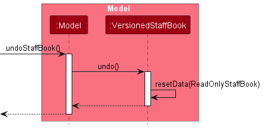
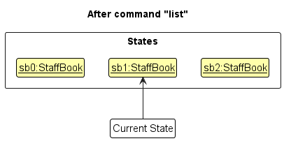
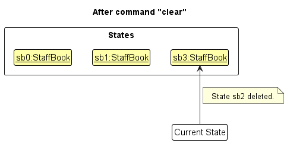

* Table of Contents
{:toc}

--------------------------------------------------------------------------------------------------------------------

## **Acknowledgements**

* This developer guide is adapted from [AB-3 Developer Guide](https://se-education.org/addressbook-level3/DeveloperGuide.html).

--------------------------------------------------------------------------------------------------------------------

## **Setting up, getting started**

Refer to the guide [_Setting up and getting started_](SettingUp.md).

--------------------------------------------------------------------------------------------------------------------

## **Design**

<div markdown="span" class="alert alert-primary">

:bulb: **Tip:** The `.puml` files used to create diagrams in this document `docs/diagrams` folder. Refer to the [_PlantUML Tutorial_ at se-edu/guides](https://se-education.org/guides/tutorials/plantUml.html) to learn how to create and edit diagrams.
</div>

### Architecture


The ***Architecture Diagram*** given above explains the high-level design of the App.

Given below is a quick overview of main components and how they interact with each other.

**Main components of the architecture**

**`Main`** (consisting of classes [`Main`](https://github.com/AY2324S2-CS2103-F08-3/tp/blob/master/src/main/java/staffconnect/Main.java) and [`MainApp`](https://github.com/AY2324S2-CS2103-F08-3/tp/blob/master/src/main/java/staffconnect/MainApp.java)) is in charge of the app launch and shut down.
* At app launch, it initializes the other components in the correct sequence, and connects them up with each other.
* At shut down, it shuts down the other components and invokes cleanup methods where necessary.

The bulk of the app's work is done by the following four components:

* [**`UI`**](#ui-component): The UI of the App.
* [**`Logic`**](#logic-component): The command executor.
* [**`Model`**](#model-component): Holds the data of the App in memory.
* [**`Storage`**](#storage-component): Reads data from, and writes data to, the hard disk.

[**`Commons`**](#common-classes) represents a collection of classes used by multiple other components.

**How the architecture components interact with each other**

The *Sequence Diagram* below shows how the components interact with each other for the scenario where the user issues the command `delete 1`.


Each of the four main components (also shown in the diagram above),

* defines its *API* in an `interface` with the same name as the Component.
* implements its functionality using a concrete `{Component Name}Manager` class (which follows the corresponding API `interface` mentioned in the previous point.

For example, the `Logic` component defines its API in the `Logic.java` interface and implements its functionality using the `LogicManager.java` class which follows the `Logic` interface. Other components interact with a given component through its interface rather than the concrete class (reason: to prevent outside component's being coupled to the implementation of a component), as illustrated in the (partial) class diagram below.


The sections below give more details of each component.

### UI component

The **API** of this component is specified in [`Ui.java`](https://github.com/AY2324S2-CS2103-F08-3/tp/blob/master/src/main/java/staffconnect/ui/Ui.java)



The UI consists of a `MainWindow` that is made up of parts e.g.`CommandBox`, `ResultDisplay`, `PersonListPanel`, `StatusBarFooter` etc. All these, including the `MainWindow`, inherit from the abstract `UiPart` class which captures the commonalities between classes that represent parts of the visible GUI.

The `UI` component uses the JavaFx UI framework. The layout of these UI parts are defined in matching `.fxml` files that are in the `src/main/resources/view` folder. For example, the layout of the [`MainWindow`](https://github.com/AY2324S2-CS2103-F08-3/tp/blob/master/src/main/java/staffconnect/ui/MainWindow.java) is specified in [`MainWindow.fxml`](https://github.com/AY2324S2-CS2103-F08-3/tp/blob/master/src/main/resources/view/MainWindow.fxml)

The `UI` component,

* executes user commands using the `Logic` component.
* listens for changes to `Model` data so that the UI can be updated with the modified data.
* keeps a reference to the `Logic` component, because the `UI` relies on the `Logic` to execute commands.
* depends on some classes in the `Model` component, as it displays `Person` object residing in the `Model`.

### Logic component

**API** : [`Logic.java`](https://github.com/AY2324S2-CS2103-F08-3/tp/blob/master/src/main/java/staffconnect/logic/Logic.java)

Here's a (partial) class diagram of the `Logic` component:


The sequence diagram below illustrates the interactions within the `Logic` component, taking `execute("delete 1")` API call as an example.


<div markdown="span" class="alert alert-info">:information_source: **Note:** The lifeline for `DeleteCommandParser` should end at the destroy marker (X) but due to a limitation of PlantUML, the lifeline continues till the end of diagram.
</div>

How the `Logic` component works:

1. When `Logic` is called upon to execute a command, it is passed to an `StaffConnectParser` object which in turn creates a parser that matches the command (e.g., `DeleteCommandParser`) and uses it to parse the command.
1. This results in a `Command` object (more precisely, an object of one of its subclasses e.g., `DeleteCommand`) which is executed by the `LogicManager`.
1. The command can communicate with the `Model` when it is executed (e.g. to delete a person).<br>
   Note that although this is shown as a single step in the diagram above (for simplicity), in the code it can take several interactions (between the command object and the `Model`) to achieve.
1. The result of the command execution is encapsulated as a `CommandResult` object which is returned back from `Logic`.

Here are the other classes in `Logic` (omitted from the class diagram above) that are used for parsing a user command:


How the parsing works:
* When called upon to parse a user command, the `StaffConnectParser` class creates an `XYZCommandParser` (`XYZ` is a placeholder for the specific command name e.g., `AddCommandParser`) which uses the other classes shown above to parse the user command and create a `XYZCommand` object (e.g., `AddCommand`) which the `StaffConnectParser` returns back as a `Command` object.
* All `XYZCommandParser` classes (e.g., `AddCommandParser`, `DeleteCommandParser`, ...) inherit from the `Parser` interface so that they can be treated similarly where possible e.g, during testing.

### Model component
**API** : [`Model.java`](https://github.com/AY2324S2-CS2103-F08-3/tp/blob/master/src/main/java/staffconnect/model/Model.java)


The `Model` component,

* stores the staff book data i.e., all `Person` objects (which are contained in a `UniquePersonList` object).
* stores the currently 'selected' `Person` objects (e.g., results of a search query) as a separate _filtered_ list which is exposed to outsiders as an unmodifiable `ObservableList<Person>` that can be 'observed' e.g. the UI can be bound to this list so that the UI automatically updates when the data in the list change.
* stores a `UserPref` object that represents the user’s preferences. This is exposed to the outside as a `ReadOnlyUserPref` objects.
* does not depend on any of the other three components (as the `Model` represents data entities of the domain, they should make sense on their own without depending on other components)

<div markdown="span" class="alert alert-info">:information_source: **Note:** An alternative (arguably, a more OOP) model is given below. It has a `Tag` list in the `StaffBook`, which `Person` references. This allows `StaffBook` to only require one `Tag` object per unique tag, instead of each `Person` needing their own `Tag` objects.<br>


</div>


### Storage component

**API** : [`Storage.java`](https://github.com/AY2324S2-CS2103-F08-3/tp/blob/master/src/main/java/staffconnect/storage/Storage.java)


The `Storage` component,
* can save both staff book data and user preference data in JSON format, and read them back into corresponding objects.
* inherits from both `StaffBookStorage` and `UserPrefStorage`, which means it can be treated as either one (if only the functionality of only one is needed).
* depends on some classes in the `Model` component (because the `Storage` component's job is to save/retrieve objects that belong to the `Model`)

### Common classes

Classes used by multiple components are in the `staffconnect.commons` package.

--------------------------------------------------------------------------------------------------------------------

## **Implementation**

This section describes some noteworthy details on how certain features are implemented.

### Filter feature

#### How the filter is implemented

The sequence diagram below shows how the filter command `filter f/Computing` goes through the `Logic` component.


<div markdown="span" class="alert alert-info">:information_source: **Note:** The lifeline for `FilterCommandParser` should end at the destroy marker (X) but due to a limitation of PlantUML, the lifeline continues till the end of diagram.
</div>

1. When the user issues the command `filter f/Computing`, `Logic` is called upon to execute the command, it is passed to the `StaffConnectParser` object which creates a `FilterCommandParser` to parse the arguments for the filter command.
2. This results in a `FilterCommand` object, which then creates a `Predicate` object.
3. The command communicates with the `Model` when it is executed. More specifically, it calls the `updateFilteredPersonList()` method using the `Predicate` object created earlier as the argument. Note that although it is shown as a single step in the diagram (for simplicity), in the code it takes several 
4. The result of the command execution is encapsulated as a `CommandResult` object which is returned back from `Logic`, to show in the `UI` component the number of persons listed with the `Faculty` value of "Computing".

The below sequence diagram goes into more detail on how the command is parsed in `FilterCommandParser`.


Within `FilterCommandParser`, the filtering criteria is parsed into `PersonHasModulePredicate`, `PersonHasFacultyPredicate`, `PersonHasTagsPredicate`, `PersonHasAvailabilitiesPredicate` objects, which extend from `Predicate`.
These `Predicate` objects are then used to construct a `FilterCommand` object, where `FilterCommand` creates its own `Predicate` object by self-calling the `setPersonPredicate()` method, where the `Predicate` produced is to be used as the argument for the `updateFilteredPersonList()` method.

The below activity diagram illustrates the process when a user executes a filter command.


#### Why filter is implemented this way

The main operation for the filter feature is the `updateFilteredPersonList(Predicate<Person> predicate)` method in the `Model` component.
The following are some explanations for decisions made in the implementation of the filter feature.

Need for multiple `Predicate` objects:
This is to keep in view for when other commands or enhancements may need the separate attribute predicates.

`FilterCommmandParser` parsing the `Predicate` objects:
This is to prevent `FilterCommand` from taking on more responsibilities (Separation of Concerns).

`FilterCommand` having `setPersonPredicate()` method:
This is so that `FilterCommand` has the required argument of type `Predicate<Person>` to be used in the `updateFilteredPersonList()` method. Since the `Predicate<Person>` object is created by chaining the multiple predicates, no parsing is involved to create this `Predicate`.

### \[Proposed\] Undo/redo feature

#### Proposed Implementation

The proposed undo/redo mechanism is facilitated by `VersionedStaffBook`. It extends `StaffBook` with an undo/redo history, stored internally as an `staffBookStateList` and `currentStatePointer`. Additionally, it implements the following operations:

* `VersionedStaffBook#commit()` — Saves the current staff book state in its history.
* `VersionedStaffBook#undo()` — Restores the previous staff book state from its history.
* `VersionedStaffBook#redo()` — Restores a previously undone staff book state from its history.

These operations are exposed in the `Model` interface as `Model#commitStaffBook()`, `Model#undoStaffBook()` and `Model#redoStaffBook()` respectively.

Given below is an example usage scenario and how the undo/redo mechanism behaves at each step.

Step 1. The user launches the application for the first time. The `VersionedStaffBook` will be initialized with the initial staff book state, and the `currentStatePointer` pointing to that single staff book state.



Step 2. The user executes `delete 5` command to delete the 5th person in the staff book. The `delete` command calls `Model#commitStaffBook()`, causing the modified state of the staff book after the `delete 5` command executes to be saved in the `staffBookStateList`, and the `currentStatePointer` is shifted to the newly inserted staff book state.



Step 3. The user executes `add n/David …​` to add a new person. The `add` command also calls `Model#commitStaffBook()`, causing another modified staff book state to be saved into the `staffBookStateList`.



<div markdown="span" class="alert alert-info">:information_source: **Note:** If a command fails its execution, it will not call `Model#commitStaffBook()`, so the staff book state will not be saved into the `staffBookStateList`.

</div>

Step 4. The user now decides that adding the person was a mistake, and decides to undo that action by executing the `undo` command. The `undo` command will call `Model#undoStaffBook()`, which will shift the `currentStatePointer` once to the left, pointing it to the previous staff book state, and restores the staff book to that state.



<div markdown="span" class="alert alert-info">:information_source: **Note:** If the `currentStatePointer` is at index 0, pointing to the initial StaffBook state, then there are no previous StaffBook states to restore. The `undo` command uses `Model#canUndoStaffBook()` to check if this is the case. If so, it will return an error to the user rather
than attempting to perform the undo.

</div>

The following sequence diagram shows how an undo operation goes through the `Logic` component:


<div markdown="span" class="alert alert-info">:information_source: **Note:** The lifeline for `UndoCommand` should end at the destroy marker (X) but due to a limitation of PlantUML, the lifeline reaches the end of diagram.

</div>

Similarly, how an undo operation goes through the `Model` component is shown below:



The `redo` command does the opposite — it calls `Model#redoStaffBook()`, which shifts the `currentStatePointer` once to the right, pointing to the previously undone state, and restores the staff book to that state.

<div markdown="span" class="alert alert-info">:information_source: **Note:** If the `currentStatePointer` is at index `staffBookStateList.size() - 1`, pointing to the latest staff book state, then there are no undone StaffBook states to restore. The `redo` command uses `Model#canRedoStaffBook()` to check if this is the case. If so, it will return an error to the user rather than attempting to perform the redo.

</div>

Step 5. The user then decides to execute the command `list`. Commands that do not modify the staff book, such as `list`, will usually not call `Model#commitStaffBook()`, `Model#undoStaffBook()` or `Model#redoStaffBook()`. Thus, the `staffBookStateList` remains unchanged.



Step 6. The user executes `clear`, which calls `Model#commitStaffBook()`. Since the `currentStatePointer` is not pointing at the end of the `staffBookStateList`, all staff book states after the `currentStatePointer` will be purged. Reason: It no longer makes sense to redo the `add n/David …​` command. This is the behavior that most modern desktop applications follow.



The following activity diagram summarizes what happens when a user executes a new command:


#### Design considerations:

**Aspect: How undo & redo executes:**

* **Alternative 1 (current choice):** Saves the entire staff book.
  * Pros: Easy to implement.
  * Cons: May have performance issues in terms of memory usage.

* **Alternative 2:** Individual command knows how to undo/redo by
  itself.
  * Pros: Will use less memory (e.g. for `delete`, just save the person being deleted).
  * Cons: We must ensure that the implementation of each individual command are correct.

_{more aspects and alternatives to be added}_

### \[Proposed\] Data archiving

_{Explain here how the data archiving feature will be implemented}_

### Meeting

Meeting is feature that allows the user to keep track of any events they may have with the particular contact. It contains the description of the meeting event with the date and time it would occur.

#### Implementation

Meeting contains two attributes ```MeetingDescription``` and ```MeetingDateTime``` class. ```MeetingDescription``` 
is used to handle any valid description of the meeting with only alphanumeric values, while the ```MeetingDateTime```
is used to handle any valid date time values. Each of this meeting are stored in a list data class ```MeetingList``` that
contains each of the meetings related to each other stored in an ```ObservableList```. The ``` MeetingManager ``` is 
used to manage any operations that require viewing or sorting of meetings from the ```MeetingList``` class.

#### Design considerations:

**Aspect: How the meetings are stored :**

* **Alternative 1 (current choice):** Store meetings in an ObservableList.
    * Pros: Better segregation of the OOP functionalities, and good integration with the UI ListView.
    * Cons: Larger code complexity.

* **Alternative 2:** Store meetings in a Set.
    * Pros: Easier implementation.
    * Cons: There is an efficiency gap as each element has to be placed into a list before it can be shown to the UI ListView.

### Mark/unmark feature

The feature enables us to mark/unmark a particular contact using an index as favourite.

#### Implementation

The Mark/Unmark feature is implemented via the `MarkCommand` and `UnmarkCommand`, which is supported by the `MarkCommandParser` and `UnmarkCommandParser` respectively.
The `MarkCommandParser` and `UnmarkCommandParser` implements the `Parser` interface.

1. `LogicManager` receives the user input which is parsed by the `StaffConnectParser`.
2. After splitting the user input into `commandWord` and `arguments` based on the regex pattern of the user input, the `StaffConnectParser` invokes the `MarkCommandParser`/`UnmarkCommandParser` based on the `commandWord`, calling the method `parse` with `arguments` as the method arguments
3. `MarkCommandParser`/`UnmarkCommandParser` takes in the `args` string and parse it into with the static `ParserUtil#parseIndex(args)` function. If the `INDEX` format is invalid, a `ParseException` will be thrown.
4. `MarkCommandParser`/`UnmarkCommandParser` then creates the `MarkCommand`/`UnmarkCommand` and returns it. 
5. The `LogicManager` executes the `MarkCommand`/`UnmarkCommand`, which creates a `Person` with the `Favourite` attribute set as `true`/`false` respectively and updates the model with this new `Person`.

The following sequence diagram shows how the `mark` command works:


Similarly, how the `unmark` command works is shown below:


--------------------------------------------------------------------------------------------------------------------

## **Documentation, logging, testing, configuration, dev-ops**

* [Documentation guide](Documentation.md)
* [Testing guide](Testing.md)
* [Logging guide](Logging.md)
* [Configuration guide](Configuration.md)
* [DevOps guide](DevOps.md)

--------------------------------------------------------------------------------------------------------------------

## **Appendix: Requirements**

### Product scope

**Target user profile**:

Bob is a 22 year old NUS SOC student who often struggles with finding details about his professors' and tutors' consultation hours.
He prefers certain professors and tutors but often misplaces their contact information
as such information can be hard to find online. He also has difficulty identifying his professors and changing tutors.

**Value proposition**:

StaffConnect offers convenience and efficiency for a forgetful tech-savvy student.
StaffConnect allows users to easily identify and connect with educators by providing visual cues alongside their contact details, supported by an easy-to-use filtering system.

### User stories

Priorities: High (must have) - `* * *`, Medium (nice to have) - `* *`, Low (unlikely to have) - `*`

| Priority | As a …​                                     | I want to …​                    | So that I can…​                                                         |
| -------- | ------------------------------------------ | ------------------------------ | ---------------------------------------------------------------------- |
| `* * *`  | sociable user                              | save a contact's name, email, phone number, title in one line | save time per entry                     |
| `* * *`  | disorganised student                       | store a professor's name       | recall how to address the professor                                    |
| `* * *`  | forgetful user                             | store a professor's faculty    | see the faculty that a professor belongs to                            |
| `* * *`  | student who get lost easily                | view the locations of my meetings/classes | search the locations for my meetings easily                 |
| `* * *`  | disorganised student                       | store a professor's consultation hours | arrange times to meet my professor for consultation            |
| `* * *`  | slow reader                                | filter through contact entry by their name | not waste time in finding a specific contact/s and access their info easily |
| `* * *`  | slow reader                                | filter through contact entry by their availability | not waste time in finding a specific contact/s and access their info easily |
| `* * *`  | slow reader                                | filter through contact entry by their module | not waste time in finding a specific contact/s and access their info easily |
| `* * *`  | disorganised student                       | store the modules a professor is teaching  | contact the professors who teach a module which I am currently taking       |
| `* * *`  | slow reader                                | filter through contact entry by their module | not waste time in finding a specific contact/s and access their info easily |
| `* * *`  | forgetful user                             | filter the professors by their faculty or the course they teach | not waste time in finding a specific contact/s and access their info easily |

*{More to be added}*

### Use cases

(For all use cases below, the **System** is the `StaffConnect` and the **Actor** is the `user`, unless specified otherwise)

**Use case: Add a person**

**MSS**

1. StaffConnect shows a list of persons
2. User requests to add a new person

   Use case ends.

**Extensions**

* 1a. The list is empty.

  Use case resumes at step 2.

**Use case: Filter the list**

**MSS**

1. StaffConnect shows a list of persons
2. User requests to filter the list by a specific attribute
3. StaffConnect shows a filtered list of persons

   Use case ends.

**Extensions**

* 1a. The list is empty.

  Use case ends.

* 2a. The list is empty.

  Use case ends.

**Use case: Sort the list**

**MSS**

1. StaffConnect shows a list of persons
2. User requests to sort the list by a specific attribute
3. StaffConnect shows a sorted list of persons

   Use case ends.

**Extensions**

* 1a. The list is empty.

  Use case ends.

**Use case: Delete a person**

**MSS**

1. StaffConnect shows a list of persons
2. User requests to delete a specific person in the list
3. StaffConnect deletes the person

   Use case ends.

**Extensions**

* 1a. The list is empty.

  Use case ends.

* 2a. The given index is invalid.

    * 2a1. StaffConnect shows an error message.

      Use case resumes at step 1.

**Use case: Edit a person**

**MSS**

1. StaffConnect shows a list of persons
2. User requests to edit a specific person in the list
3. StaffConnect edits the person

   Use case ends.

**Extensions**

* 1a. The list is empty.

  Use case ends.

* 2a. The given index is invalid.

    * 2a1. StaffConnect shows an error message.

      Use case resumes at step 1.

*{More to be added}*

### Non-Functional Requirements

1. Should work on any _mainstream OS_ as long as it has Java `11` or above installed.
2. Should be able to answer a user's prompt within 1 second.
3. Should require less computational resources to allow users with older hardware can use the app without trouble.
4. Should be able to hold up to 1000 persons without a noticeable sluggishness in performance for typical usage.
5. Should be able to provide error messages when a user does not type in expected prompts.
6. Should be able to store the users' information securely without leakage.
7. Should provide understandable and informative responses whenever a user provides a prompt.
8. A user with above average typing speed for regular English text (i.e. not code, not system admin commands) should be able to accomplish most of the tasks faster using commands than using the mouse.
9. A user without much experience in admin commands should be able to handle the usage in rather short time.

*{More to be added}*

### Glossary

* **Mainstream OS**: Windows, Linux, Unix, MacOS, with versions that support Java 11
* **Private contact detail**: A contact detail that is not meant to be shared with others
* **Users' Information**: Same as above
* **Error Message**: A prompt printed to the user that the program execution cannot run normally and specifies the most possible cause
* **MSS**: Main Success Scenario

--------------------------------------------------------------------------------------------------------------------

## **Appendix: Instructions for manual testing**

Given below are instructions to test the app manually.

<div markdown="span" class="alert alert-info">:information_source: **Note:** These instructions only provide a starting point for testers to work on;
testers are expected to do more *exploratory* testing.

</div>

### Launch and shutdown

1. Initial launch

   1. Download the jar file and copy into an empty folder

   1. Double-click the jar file Expected: Shows the GUI with a set of sample contacts. The window size may not be optimum.

1. Saving window preferences

   1. Resize the window to an optimum size. Move the window to a different location. Close the window.

   1. Re-launch the app by double-clicking the jar file.<br>
       Expected: The most recent window size and location is retained.

1. _{ more test cases …​ }_

### Deleting a person

1. Deleting a person while all persons are being shown

   1. Prerequisites: List all persons using the `list` command. Multiple persons in the list.

   1. Test case: `delete 1`<br>
      Expected: First contact is deleted from the list. Details of the deleted contact shown in the status message. Timestamp in the status bar is updated.

   1. Test case: `delete 0`<br>
      Expected: No person is deleted. Error details shown in the status message. Status bar remains the same.

   1. Other incorrect delete commands to try: `delete`, `delete x`, `...` (where x is larger than the list size)<br>
      Expected: Similar to previous.

1. _{ more test cases …​ }_

### Saving data

1. Dealing with missing/corrupted data files

   1. _{explain how to simulate a missing/corrupted file, and the expected behavior}_

1. _{ more test cases …​ }_
